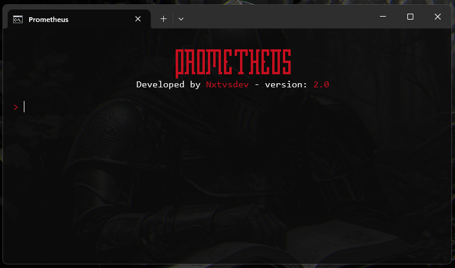
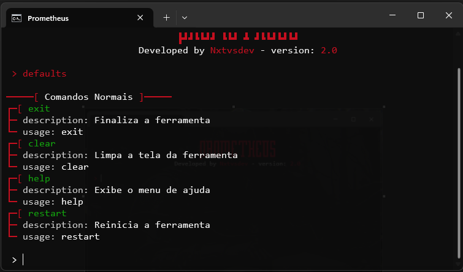

# Prometheus v2

> Ferramenta de interface CLI desenvolvida usando Python e com total foco em sistemas Windows

> **Objetivo:** A ideia por trás da ferramenta é auxiliar o usuário em seu local de trabalho automatizando tarefas, disponibilizando funções úteis de forma que o fluxo de trabalho e a produtividade do usuário vão aumentar.

---

## EM DESENVOLVIMENTO

---

A ferramenta acaba de entrar nas fases iniciais de desenvolvimento; apesar de ser a versão 2 de uma ferramenta mais antiga, ela contará com uma nova estrutura.

Copyright 2026 - Prometheus, Nxtvsdev
